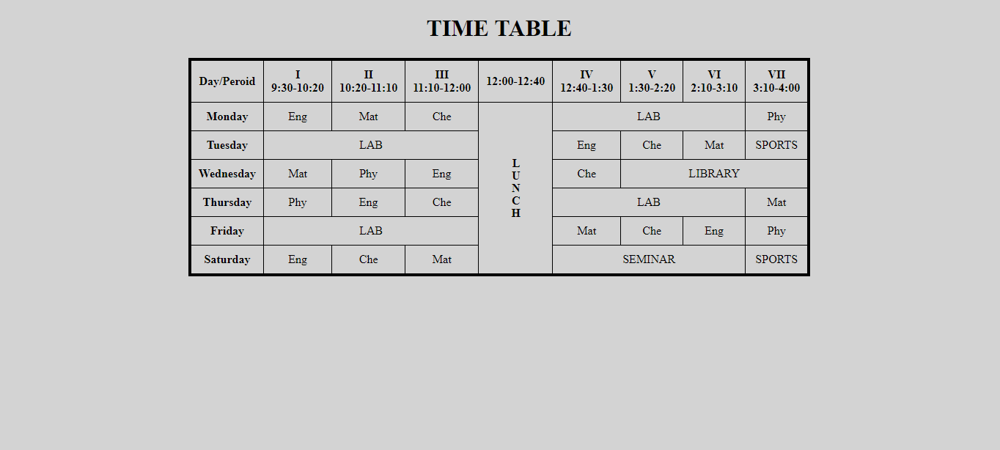

# 📚 Class Routine Table 🕒

Welcome to the **Class Routine Table Project**! 🎉 This simple project is a demonstration of how to create a responsive and visually pleasing timetable using **HTML** and **CSS**. If you're just starting to learn tables, this is a great reference to understand the basics! 💡

---

## 🖼️ Project Overview

This project showcases:
- A weekly class timetable 📆, with neatly arranged periods and lunch breaks 🍴.
- Use of **HTML tables** for organizing data in a structured format.
- Stylish and minimal **CSS styling** for enhanced presentation. 🎨

---

## 📂 Files in the Project

- **index.html**: The main HTML file containing the timetable structure.
- **styles.css**: The stylesheet that adds the magic of colors, alignment, and styling.

---

## 🌟 Features

- **Dynamic Layout**: Includes merged cells and a vertical 'Lunch' column for better readability.
- **Clean Design**: Minimalist design with a focus on clarity.
- **Beginner-Friendly**: Perfect for those learning to create tables in HTML. 🌱

---

## 🚀 How to Use

1. Clone or download this repository to your local machine. 💻  
2. Open the `index.html` file in your favorite web browser. 🌐  
3. Enjoy your beautifully crafted class routine! 🎓

---

## 📸 Preview

Here’s how the table looks:   

---

## 🤔 Why This Project?

This project is a part of my journey to learn **HTML tables** and how to style them effectively. 🛠️ It includes basic features like merged cells, column spans, and row spans for more complex layouts.

---

## 🛠️ Technologies Used

- **HTML** 🖋️  
- **CSS** 🎨

---

## 🌟 What’s Next?

- Add interactive features like hover effects or clickable cells. 🖱️  
- Make the table responsive for different screen sizes 📱.  
- Add themes or dynamic content using JavaScript. 🚀  

---

## 📢 Feedback

Feel free to fork this repository, experiment with it, and share your feedback! Your suggestions are always welcome. 💬  

---

### ✨ Happy Coding! 🧑‍💻✨  
